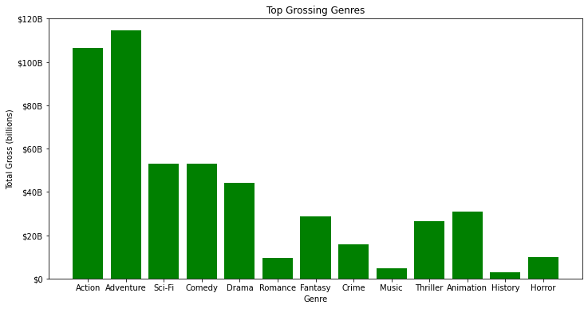
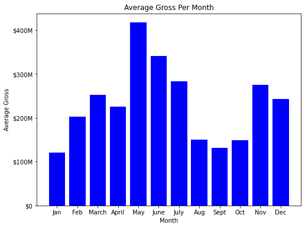

# Microsoft Movie Studios

**Author**: Mario Mocombe

## Overview

Microsoft is creating a new movie studio and is inquiring about what types of films are currently doing the best at the box office. The datasets used in answering the business problem are from various movie websites and contain box office information. Methods used were exploratory data analysis, data cleaning, and data manipulation. The data shows that the highest grossing genre of films are Adventure, Action, and Comedy. The highest grossing time of the year for movie releases is May. There is also a positive correlation between a film's production budget and its profits. Ideally, we should make it a priority to hire Christopher Nolan as film director.

## Business Problem

Microsoft sees all the big companies creating original video content and they want to get in on the fun. They have decided to create a new movie studio, but they don’t know anything about creating movies. You are charged with exploring what types of films are currently doing the best at the box office. You must then translate those findings into actionable insights that the head of Microsoft's new movie studio can use to help decide what type of films to create.

Questions to consider:

What are the highest grossing genre of movies?
What time of the year is best to release a movie?
Is there a correlation between budget and profit?
Who are fan favorite directors that we should look to hire?

These questions were considered in order to maximize studio success. Profits are one marker of a film's success, telling us whether or not the film was financially worth pursuing. Finding out whether a large budget is favorable will aid the studio into making informed decisions. Data on the highest grossing genres will help Microsoft Studios narrow down on what type of films to invest in. The release window also influences a film's success. It's key that the studio releases it at a time where the most people will go see it. Finally, it's important to choose a proven visionary for the director's chair.

## Data

1. im.db.zip

A zipped SQLite database containing movie data from the website Internet Movie Data Base. There is information on genre, online user votes, average user ratings, roles of people involved in the film etc... The most relevant tables are movie_basics and movie_ratings.

2. bom.movie_gross.csv.gz

A compressed CSV file containing box office data from the website Box Office Mojo. Domestic and Foreign Gross are the most relevant features.

3. tn.movie_budgets.csv.gz

A compressed CSV file containing box office data, release dates, and budget data from the website The Numbers.


## Methods

Data cleaning: Identifying and handling missing values

Data aggregation: Joining dataframes and using summary statistics 

Exploratory Data Analysis: Looking at the data in-depth, finding useful patterns and spotting anomalies while using visual aids to understand the data.

***

## Results

The top grossing genres are Adventure, Action, and Comedy with the best month for releasing a movie being May.  There is a strong correlation between budget and profits.  Christopher Nolan is a well rounded, popular director that should be sought after.

I am confident that these results would generalize beyond the data for the most part.  The one thing I'm uncertain about is the 3rd highest grossing genre may be different with a larger dataset than the 716 popular IMDB titles used in this analysis.


Here is an example of how to embed images from your sub-folder:

### Visual 1


### Visual 2


### Visual 3


### Visual 4


### Visual 5


## Conclusions

I recommend that Microsoft Studios collaborate with Christopher Nolan and release a big budget film that is, at minumum, heavy on action & adventure. The film should aim for a May release so that it can benefit from the summer box office boom.

Still, there are some reasons that this recommendation may not fully solve the business problem. Depending on what competing studios are doing, the release window may be overcrowded by other films. The analysis also doesn't make predictions farther out into the future. Older films will probably have less online engagement on IMDB compared to modern ones. Further, having additional data available would aid Microsoft into making better informed decisions. It would be helpful to have the following data in the future: movie streaming numbers, digital purchase and rental sales, VHS and DVD sales, and data during the pandemic and the post-pandemic recovery period.

## For More Information

Please review my full analysis in [Jupyter Notebook](./notebook.ipynb) or my [presentation](./Presentation.pdf).

For any additional questions, please contact **Mario Mocombe, mario.mocombe@gmail.com**

## Repository Structure


``````
├── drafts
│   ├── Draft v1-7.ipynb                <- drafts of project analysis
├── images
│   ├── 1.png                           <- image of top grossing genres
│   ├── 2.png                           <- image of avg gross per month
│   ├── 3.png                           <- image of budget/profit scatterplot
│   ├── 4.png                           <- image of director avg gross
│   └── 5.png                           <- image of imdb popularity
├── zippedData
│   ├── bom.movie_gross.csv.gz          <- .csv file of Box Office Mojo dataset
│   ├── im.db.zip                       <- .zip file of IMDB data in SQLite
│   ├── rt.movie_info.tsv.gz            <- .tsv file of movie info from Rottentomatoes
│   ├──  rt.reviews.tsv.gz               <- .tsv file of reviews from Rottentomatoes
│   ├── tmdb.movies.csv.gz              <- .csv file of dataset from The Movie Database
│   └── tn.movie_budgets.csv.gz         <- .csv file of dataset from The Numbers
├── .gitignore                          <- files to ignore when committing project
├── Presentation.pdf                    <- PDF version of project presentation
├── README.md                           <- the top-level README for reviewers of this project
├── movie_data_erd.jpeg                 <- ERD of im.db database
├── notebook.ipynb                      <- final version of project analysis
└── student.ipynb                       <- final project submission
``````
